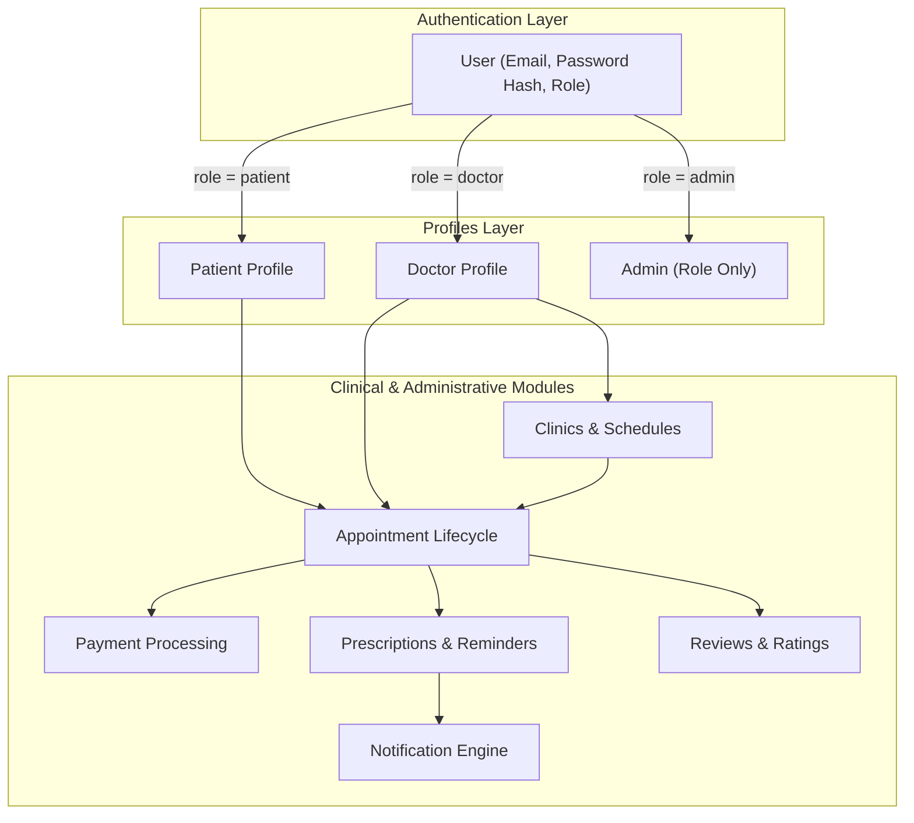
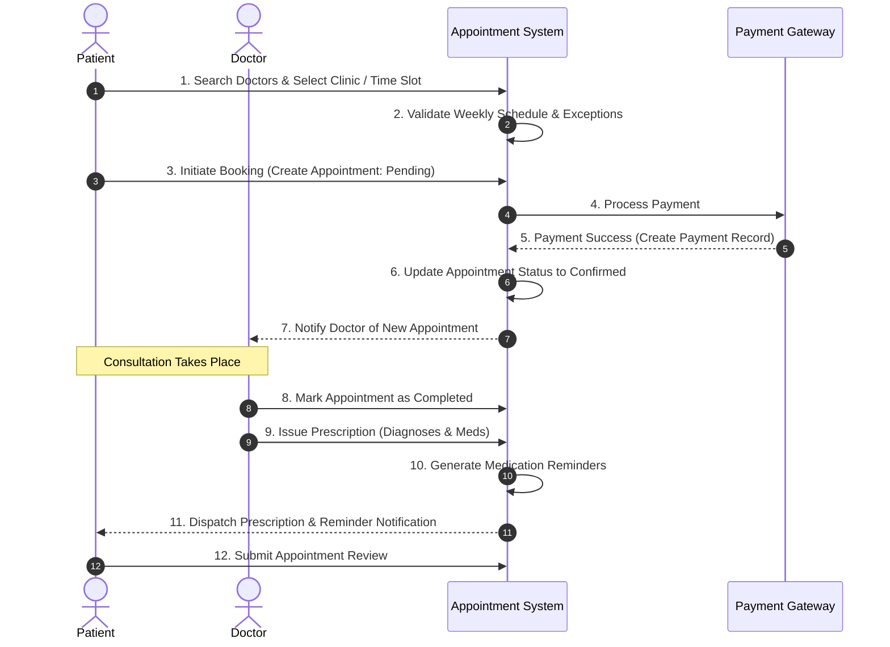

# Doctor Appointment Management System — System Description

## 1. Executive Summary

The **Doctor Appointment Management System** is a modern, enterprise-grade digital healthcare platform designed to seamlessly connect patients with healthcare providers (doctors and clinics). The platform streamlines the entire clinical lifecycle — from doctor discovery, clinic schedule management, and appointment booking to payment processing, electronic prescriptions, medication reminder tracking, patient reviews, and administrative analytics.

Built with security, scalability, and clinical integrity as primary design goals, the system employs a role-based access control (RBAC) architecture built on a single, unified authentication core, ensuring secure multi-tenant capabilities across patients, doctors, and system administrators.

---

## 2. Core Architectural Pillars & Philosophy

### 2.1 Unified Authentication & Profile Extension
The foundation of the database design separates **Identity & Authentication** from **Domain Profiles**:
* **Identity (`User`)**: Holds pure authentication data — credentials (`email`, `password_hash`) and access control (`role`: `patient`, `doctor`, `admin`). It contains no personal or clinical information.
* **Profile Extensions (`Patient` / `Doctor`)**: Extend the `User` account in a `1 : 0..1` relationship depending on the role. Administrators operate directly via the `User` account without requiring a separate profile entity, minimizing storage overhead and avoiding redundant tables.

### 2.2 Decoupled Financial Pricing (Snapshotting Strategy)
To resolve multi-clinic pricing variations:
* **Doctor-Clinic Assignment**: Consultation fees are detached from the doctor profile and attached to the doctor-clinic link, allowing a doctor to charge different rates at different clinic locations.
* **Price Snapshotting**: When an appointment is booked, the effective consultation fee is copied onto the appointment record (`consultation_fee_snapshot`). Future fee updates by a doctor or clinic will never alter past financial transaction records.

### 2.3 Two-Tier Availability Engine
Doctor availability is decomposed into two distinct, non-conflicting components:
1. **Weekly Availability (Recurring Template)**: Defines recurring day-of-week slots, time windows, slot durations, and clinic associations.
2. **Schedule Exceptions (Ad-hoc Overrides)**: Captures one-off deviations (vacations, emergency leave, holidays, or extra shifts).
*Slot computation evaluates requested times against both tiers simultaneously to guarantee zero double-booking.*

### 2.4 Prescription & Medication Architecture
* **Shared Catalogs**: `Diagnosis` (ICD codes) and `Medication` (generic names, formulations) serve as master reference catalogs.
* **Prescribed Medication Subdocuments**: Dosage, frequency, administration instructions, and notes are specific to a single prescription-patient instance and are stored on the prescription line item.
* **Automated Reminder Scheduling**: Reminders are generated directly from prescribed medication items, tracking scheduled dispatch times and patient completion acknowledgments.

### 2.5 Dynamic Medical History (Aggregation View)
Medical history is **not** stored as a static, duplicated database table. Instead, it is computed on-demand through efficient database views/aggregation pipelines joining a patient's historical appointments, prescriptions, diagnoses, and prescribed medications. This eliminates data redundancy and prevents stale clinical records.

---

## 3. High-Level Subsystem Breakdown

### 3.1 User & Identity Management
* **Single Sign-On / Unified Auth**: Single entry point for all roles.
* **Patient Profile**: Captures demographics, contact info, emergency contacts, occupation, and company details.
* **Doctor Profile**: Tracks qualifications, medical specializations, education, experience, bio, and aggregate ratings.

### 3.2 Clinic & Schedule Subsystem
* **Clinic Management**: Stores clinic facilities, addresses, operating hours, and contact details.
* **Assignment Engine**: Links doctors to clinics with custom fees and active statuses.
* **Slot Generation**: Calculates available booking slots using weekly templates minus schedule exceptions and existing bookings.

### 3.3 Appointment & Financial Engine
* **Booking & State Machine**: Tracks status (`Pending`, `Confirmed`, `Completed`, `Cancelled`, `No-Show`).
* **Payment Processing**: 1:1 mapping with appointments, recording payment status, method, external transaction references, and retry attempt counters.

### 3.4 Clinical & Patient Care Subsystem
* **Prescriptions**: Issued by doctors upon appointment completion.
* **Diagnosis Reference**: Integrated with standardized ICD catalog items.
* **Medication & Reminders**: Tracks individual dosage schedules and patient adherence.
* **Reviews**: Enforces 1 review per completed appointment to ensure authentic patient feedback.

### 3.5 Communications & Analytics
* **Notification Engine**: System-wide alerting for appointment updates, payment receipts, and medication alerts.
* **Admin Dashboard & Reporting**: Aggregates utilization metrics, doctor performance, financial revenue, and diagnostic trends.

---

## 4. Primary Data Flows

