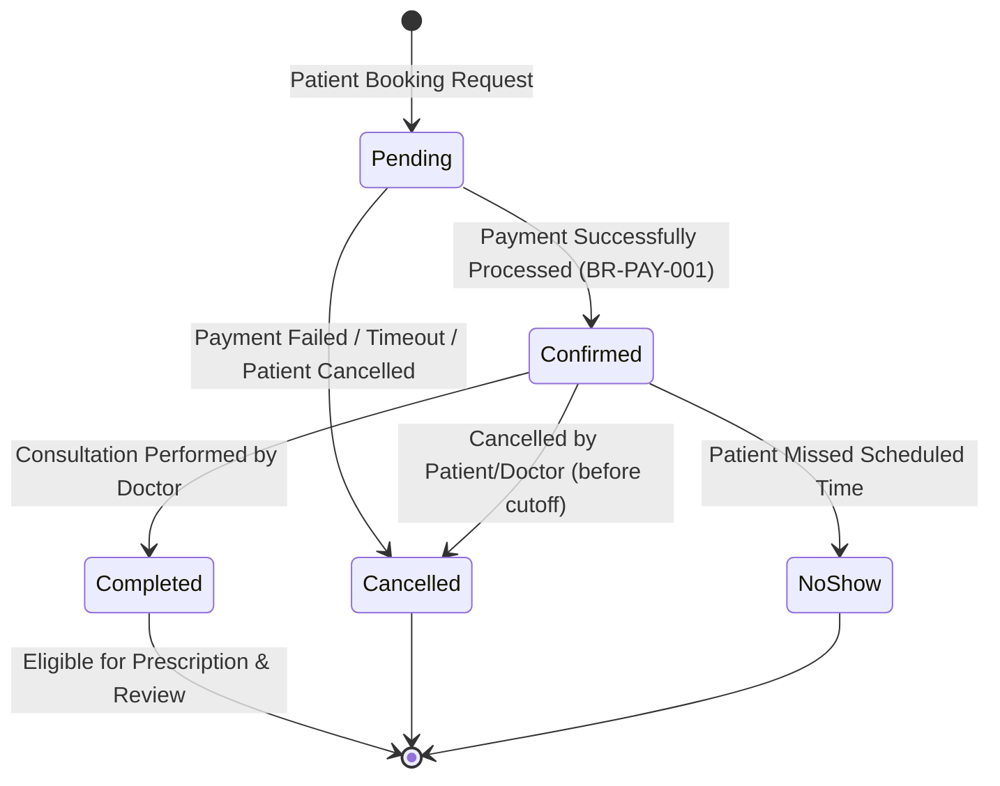

# Business Rules & System Constraints

This document defines the formal business rules, validation constraints, and state transition engines enforced by the Doctor Appointment Management System database and application logic.

---

## 1. Authentication & Identity Management

| Rule ID | Rule Name | Description | Database Enforcement |
|---|---|---|---|
| **BR-AUTH-001** | Unique Email Identity | Every user account must have a unique, lowercase email address. | `UNIQUE` index on `User.email`. |
| **BR-AUTH-002** | Role Assignment | A user must be assigned exactly one role from the allowed set (`patient`, `doctor`, `admin`). | Check constraint / enum constraint on `User.role`. |
| **BR-AUTH-003** | Profile Extension Coupling | Users with role `patient` MUST have a matching `Patient` profile. Users with role `doctor` MUST have a matching `Doctor` profile. Users with role `admin` MUST NOT have a profile record in either table. | Foreign Key unique constraint `User.user_id = Patient.user_id` / `Doctor.user_id`. |
| **BR-AUTH-004** | Password Hashing | Plaintext passwords must never be stored. Passwords must be hashed using bcrypt/Argon2 before storage. | String validation & application auth guard. |

---

## 2. Clinic & Doctor Management

| Rule ID | Rule Name | Description | Database Enforcement |
|---|---|---|---|
| **BR-CLINIC-001** | Doctor-Clinic Association | A doctor can practice at a clinic only if an active `Doctor_Clinic_Assignment` record exists. | Unique compound key `(doctor_id, clinic_id)`. |
| **BR-CLINIC-002** | Non-Negative Consultation Fee | The consultation fee set on `Doctor_Clinic_Assignment` must be a non-negative decimal value ($\ge 0.00$). | Check constraint `consultation_fee >= 0`. |
| **BR-CLINIC-003** | Unique Assignment | A doctor cannot be assigned to the same clinic multiple times simultaneously. | Compound `UNIQUE` index on `(doctor_id, clinic_id)`. |

---

## 3. Availability & Scheduling Rules

| Rule ID | Rule Name | Description | Database Enforcement |
|---|---|---|---|
| **BR-SCHED-001** | Valid Time Window | Weekly availability `end_time` must strictly succeed `start_time` (`end_time > start_time`). | Check constraint `end_time > start_time`. |
| **BR-SCHED-002** | Valid Slot Granularity | `slot_duration_minutes` must be a positive integer between 10 and 120 minutes. | Check constraint `slot_duration_minutes BETWEEN 10 AND 120`. |
| **BR-SCHED-003** | Exception Date Validation | For schedule exceptions, `end_date` must be greater than or equal to `start_date`. | Check constraint `end_date >= start_date`. |
| **BR-SCHED-004** | Anti-Overlapping Booking | No two active appointments (`Pending`, `Confirmed`, `Completed`) can exist for the same doctor at overlapping times. | Compound index on `(doctor_id, appointment_date, appointment_time)` and transaction validation. |

---

## 4. Appointment Lifecycle & Financial Rules

| Rule ID | Rule Name | Description | Database Enforcement |
|---|---|---|---|
| **BR-APP-001** | Price Snapshotting | Upon appointment creation, `consultation_fee_snapshot` must be copied from `Doctor_Clinic_Assignment.consultation_fee`. | Application trigger / service layer copy. |
| **BR-APP-002** | Allowed Consultation Types | `consultation_type` must be either `'in-clinic'` or `'online'`. | Check constraint / enum validation. |
| **BR-APP-003** | Appointment Status Hierarchy | Status transitions must follow the formal state diagram above (`Pending` $\rightarrow$ `Confirmed` $\rightarrow$ `Completed` / `Cancelled` / `NoShow`). | State machine check / DB constraint. |
| **BR-APP-004** | Future Booking Requirement | Appointment date/time must be set in the future relative to booking time. | Application validation rule. |

---

## 5. Payment & Transaction Processing

| Rule ID | Rule Name | Description | Database Enforcement |
|---|---|---|---|
| **BR-PAY-001** | Appointment Payment Binding | Every appointment requires exactly one associated `Payment` record (`1 : 1`). | Foreign Key unique constraint on `Payment.appointment_id`. |
| **BR-PAY-002** | Amount Match Validation | Payment `amount` must strictly equal `Appointment.consultation_fee_snapshot`. | Pre-save trigger check. |
| **BR-PAY-003** | Unique Transaction Reference | Successful payments must possess a non-null, unique external `transaction_ref`. | Partial unique index on `transaction_ref` WHERE `status = 'Completed'`. |
| **BR-PAY-004** | Retry Attempt Tracking | Payment `attempt_count` increments on failed payment retries, starting at 1. | Check constraint `attempt_count >= 1`. |

---

## 6. Clinical Prescriptions & Reminders

| Rule ID | Rule Name | Description | Database Enforcement |
|---|---|---|---|
| **BR-RX-001** | Completed Visit Prerequisite | A prescription can ONLY be created for an appointment with `status = 'Completed'`. | Service pre-condition check. |
| **BR-RX-002** | Minimum One Medication Line | A prescription must contain at least one prescribed medication entry. | Schema validation rule (array length $\ge 1$). |
| **BR-RX-003** | Diagnosis ICD Validation | All linked diagnoses must reference valid catalog items with standard ICD codes. | Foreign key constraint `diagnosis_id`. |
| **BR-REM-001** | Automated Reminder Scheduling | Medication reminders are automatically calculated from prescribed dosage and frequency schedules. | Background job / service generation logic. |

---

## 7. Patient Reviews & Notifications

| Rule ID | Rule Name | Description | Database Enforcement |
|---|---|---|---|
| **BR-REV-001** | One Review Per Appointment | A review can only be submitted for a `Completed` appointment, and exactly one review is allowed per appointment. | Unique key on `Review.appointment_id`. |
| **BR-REV-002** | Valid Rating Scale | Review rating integer must strictly fall within the range $1 \le \text{rating} \le 5$. | Check constraint `rating BETWEEN 1 AND 5`. |
| **BR-NOTIF-001** | Recipient Validation | Notifications must target a valid `User.user_id` and maintain `read_status` in (`UNREAD`, `READ`). | Foreign key `recipient_id`, default `'UNREAD'`. |
