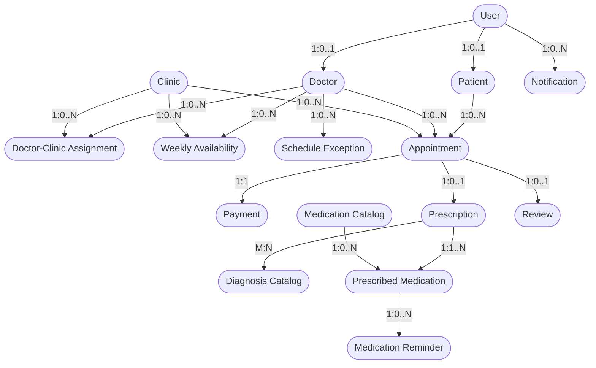

# System Entities & Data Models

This document defines the 15 core entities that constitute the Doctor Appointment Management System domain model, detailing their attributes, data types, key constraints, and relationships.

---

## Conceptual Entity Hierarchy

---

## Entity Definitions

### 1. User
* **Purpose**: Central authentication entity holding login credentials and global role definitions. Contains no clinical or personal metadata.
* **Attributes**:
  | Attribute | Data Type | Key | Nullable | Description & Constraints |
  |---|---|---|---|---|
  | `user_id` | UUID / ObjectId | PK | No | Unique identity primary key |
  | `email` | VARCHAR(255) | Unique | No | Standard email format, case-insensitive unique |
  | `password_hash` | VARCHAR(255) | None | No | Hashed credential string (bcrypt/Argon2) |
  | `role` | VARCHAR(20) | None | No | Enum: `'patient'`, `'doctor'`, `'admin'` |
  | `created_at` | TIMESTAMP | None | No | Record creation timestamp |
  | `updated_at` | TIMESTAMP | None | No | Record last update timestamp |

### 2. Patient Profile
* **Purpose**: Stores personal demographics, contact data, and employment details for users with `role = 'patient'`.
* **Attributes**:
  | Attribute | Data Type | Key | Nullable | Description & Constraints |
  |---|---|---|---|---|
  | `patient_id` | UUID / ObjectId | PK | No | Unique patient primary key |
  | `user_id` | UUID / ObjectId | FK, Unique | No | References `User.user_id` (1:1 link) |
  | `full_name` | VARCHAR(150) | None | No | Patient's full legal name |
  | `address` | TEXT | None | Yes | Physical residential address |
  | `age` | INT | None | Yes | Patient age in years ($0 \le \text{age} \le 120$) |
  | `gender` | VARCHAR(20) | None | Yes | Enum: `'Male'`, `'Female'`, `'Other'`, `'Prefer not to say'` |
  | `phone` | VARCHAR(30) | None | No | Primary contact phone number |
  | `occupation` | VARCHAR(100) | None | Yes | Employment occupation |
  | `company_name` | VARCHAR(150) | None | Yes | Employer / company name |

### 3. Doctor Profile
* **Purpose**: Holds professional credentials, specialization, education, and aggregate rating metrics for doctors.
* **Attributes**:
  | Attribute | Data Type | Key | Nullable | Description & Constraints |
  |---|---|---|---|---|
  | `doctor_id` | UUID / ObjectId | PK | No | Unique doctor primary key |
  | `user_id` | UUID / ObjectId | FK, Unique | No | References `User.user_id` (1:1 link) |
  | `full_name` | VARCHAR(150) | None | No | Doctor's professional title and name |
  | `specialization` | VARCHAR(100) | None | No | Primary medical specialty (e.g., Cardiology) |
  | `education` | TEXT | None | Yes | Medical degrees and university background |
  | `qualifications` | TEXT | None | Yes | Board certifications and licenses |
  | `years_experience` | INT | None | Yes | Total years in professional practice |
  | `bio` | TEXT | None | Yes | Professional biography summary |
  | `rating` | DECIMAL(3,2) | None | No | Aggregate rating score ($0.00 \le \text{rating} \le 5.00$, default $0.00$) |

### 4. Clinic
* **Purpose**: Represents a healthcare facility, office, or medical center where doctors host appointments.
* **Attributes**:
  | Attribute | Data Type | Key | Nullable | Description & Constraints |
  |---|---|---|---|---|
  | `clinic_id` | UUID / ObjectId | PK | No | Unique clinic primary key |
  | `name` | VARCHAR(150) | None | No | Official facility name |
  | `address` | TEXT | None | No | Street address of clinic |
  | `city` | VARCHAR(100) | None | No | City location |
  | `contact_info` | VARCHAR(100) | None | No | Clinic phone / main contact email |
  | `working_hours` | VARCHAR(255) | None | Yes | Summary operating hours text |

### 5. Doctor-Clinic Assignment
* **Purpose**: Junction entity defining which doctors practice at which clinics, along with location-specific consultation fees.
* **Attributes**:
  | Attribute | Data Type | Key | Nullable | Description & Constraints |
  |---|---|---|---|---|
  | `assignment_id` | UUID / ObjectId | PK | No | Unique assignment primary key |
  | `doctor_id` | UUID / ObjectId | FK | No | References `Doctor.doctor_id` |
  | `clinic_id` | UUID / ObjectId | FK | No | References `Clinic.clinic_id` |
  | `consultation_fee` | DECIMAL(10,2) | None | No | Fee charged at this specific clinic ($\ge 0.00$) |
  | `is_active` | BOOLEAN | None | No | Active assignment status flag (default `true`) |

### 6. Weekly Availability
* **Purpose**: Defines recurring weekly schedule templates for a doctor at a specific clinic location.
* **Attributes**:
  | Attribute | Data Type | Key | Nullable | Description & Constraints |
  |---|---|---|---|---|
  | `availability_id` | UUID / ObjectId | PK | No | Unique availability template key |
  | `doctor_id` | UUID / ObjectId | FK | No | References `Doctor.doctor_id` |
  | `clinic_id` | UUID / ObjectId | FK | No | References `Clinic.clinic_id` |
  | `day_of_week` | VARCHAR(15) | None | No | Enum: `'Monday'`, `'Tuesday'`, ..., `'Sunday'` |
  | `start_time` | TIME | None | No | Window start time (e.g., `09:00:00`) |
  | `end_time` | TIME | None | No | Window end time (e.g., `17:00:00`) |
  | `slot_duration_minutes` | INT | None | No | Duration per slot in minutes (default 30) |

### 7. Schedule Exception
* **Purpose**: Tracks one-off leave, blocked dates, or extra emergency availability for doctors.
* **Attributes**:
  | Attribute | Data Type | Key | Nullable | Description & Constraints |
  |---|---|---|---|---|
  | `exception_id` | UUID / ObjectId | PK | No | Unique schedule exception primary key |
  | `doctor_id` | UUID / ObjectId | FK | No | References `Doctor.doctor_id` |
  | `start_date` | DATE | None | No | Exception period start date |
  | `end_date` | DATE | None | No | Exception period end date |
  | `type` | VARCHAR(30) | None | No | Enum: `'VACATION'`, `'BLOCKED'`, `'EXTRA_AVAILABILITY'` |

### 8. Appointment
* **Purpose**: Central transaction record capturing a scheduled clinical consultation between a patient and a doctor at a clinic.
* **Attributes**:
  | Attribute | Data Type | Key | Nullable | Description & Constraints |
  |---|---|---|---|---|
  | `appointment_id` | UUID / ObjectId | PK | No | Unique appointment primary key |
  | `patient_id` | UUID / ObjectId | FK | No | References `Patient.patient_id` |
  | `doctor_id` | UUID / ObjectId | FK | No | References `Doctor.doctor_id` |
  | `clinic_id` | UUID / ObjectId | FK | No | References `Clinic.clinic_id` |
  | `booking_date` | TIMESTAMP | None | No | Date/time when booking request occurred |
  | `appointment_date` | DATE | None | No | Date of consultation |
  | `appointment_time` | TIME | None | No | Scheduled start time |
  | `consultation_type` | VARCHAR(20) | None | No | Enum: `'in-clinic'`, `'online'` |
  | `reason` | TEXT | None | Yes | Patient's reason for booking visit |
  | `duration_minutes` | INT | None | No | Expected duration in minutes |
  | `status` | VARCHAR(20) | None | No | Enum: `'Pending'`, `'Confirmed'`, `'Completed'`, `'Cancelled'`, `'No-Show'` |
  | `consultation_fee_snapshot` | DECIMAL(10,2) | None | No | Fee rate frozen at booking time |

### 9. Payment
* **Purpose**: Records transaction processing, payment status, and financial audit metadata for an appointment.
* **Attributes**:
  | Attribute | Data Type | Key | Nullable | Description & Constraints |
  |---|---|---|---|---|
  | `payment_id` | UUID / ObjectId | PK | No | Unique payment primary key |
  | `appointment_id` | UUID / ObjectId | FK, Unique | No | References `Appointment.appointment_id` (1:1) |
  | `amount` | DECIMAL(10,2) | None | No | Paid transaction amount |
  | `method` | VARCHAR(30) | None | No | Enum: `'Credit Card'`, `'Debit Card'`, `'Cash'`, `'Insurance'` |
  | `payment_date` | TIMESTAMP | None | No | Timestamp of transaction |
  | `status` | VARCHAR(20) | None | No | Enum: `'Pending'`, `'Completed'`, `'Failed'`, `'Refunded'` |
  | `transaction_ref` | VARCHAR(100) | Unique | Yes | External payment gateway transaction ID |
  | `attempt_count` | INT | None | No | Counter tracking charge attempts (default 1) |

### 10. Prescription
* **Purpose**: Issued by a doctor following a completed appointment, linking diagnoses and prescribed medications.
* **Attributes**:
  | Attribute | Data Type | Key | Nullable | Description & Constraints |
  |---|---|---|---|---|
  | `prescription_id` | UUID / ObjectId | PK | No | Unique prescription primary key |
  | `appointment_id` | UUID / ObjectId | FK, Unique | No | References `Appointment.appointment_id` |
  | `issued_date` | DATE | None | No | Date prescription was written |

### 11. Diagnosis Catalog
* **Purpose**: Master reference catalog of clinical diagnoses, conditions, and standard ICD codes.
* **Attributes**:
  | Attribute | Data Type | Key | Nullable | Description & Constraints |
  |---|---|---|---|---|
  | `diagnosis_id` | UUID / ObjectId | PK | No | Unique diagnosis primary key |
  | `name` | VARCHAR(150) | None | No | Standard medical condition name |
  | `icd_code` | VARCHAR(20) | Unique | No | International Classification of Diseases code |
  | `description` | TEXT | None | Yes | Clinical description of condition |

### 12. Medication Catalog
* **Purpose**: Master reference catalog of available pharmacological drugs and formulations.
* **Attributes**:
  | Attribute | Data Type | Key | Nullable | Description & Constraints |
  |---|---|---|---|---|
  | `medication_id` | UUID / ObjectId | PK | No | Unique medication primary key |
  | `name` | VARCHAR(150) | None | No | Commercial / brand name |
  | `generic_name` | VARCHAR(150) | None | No | Pharmacological generic active ingredient |
  | `type` | VARCHAR(50) | None | No | Dosage form: `'Tablet'`, `'Syrup'`, `'Injection'`, `'Capsule'` |

### 13. Prescribed Medication
* **Purpose**: Line item connecting a prescription to a catalog medication, capturing dosage, frequency, and instructions.
* **Attributes**:
  | Attribute | Data Type | Key | Nullable | Description & Constraints |
  |---|---|---|---|---|
  | `prescribed_item_id` | UUID / ObjectId | PK | No | Unique prescribed item identifier |
  | `prescription_id` | UUID / ObjectId | FK | No | References `Prescription.prescription_id` |
  | `medication_id` | UUID / ObjectId | FK | No | References `Medication.medication_id` |
  | `dosage` | VARCHAR(50) | None | No | Specific dose (e.g., `'500 mg'`) |
  | `frequency` | VARCHAR(50) | None | No | Intake frequency (e.g., `'Every 8 hours'`) |
  | `duration` | VARCHAR(50) | None | No | Length of treatment (e.g., `'7 days'`) |
  | `instructions` | TEXT | None | Yes | Intake instructions (e.g., `'Take after meals'`) |
  | `notes` | TEXT | None | Yes | Special clinical notes |

### 14. Medication Reminder
* **Purpose**: Patient reminder alerts spawned from prescribed medication schedules to track adherence.
* **Attributes**:
  | Attribute | Data Type | Key | Nullable | Description & Constraints |
  |---|---|---|---|---|
  | `reminder_id` | UUID / ObjectId | PK | No | Unique reminder primary key |
  | `prescribed_item_id` | UUID / ObjectId | FK | No | References `PrescribedMedication.prescribed_item_id` |
  | `scheduled_time` | TIMESTAMP | None | No | Scheduled alert execution timestamp |
  | `acknowledgment_status` | VARCHAR(20) | None | No | Enum: `'PENDING'`, `'ACKNOWLEDGED'` |
  | `completion_status` | VARCHAR(20) | None | No | Enum: `'TAKEN'`, `'MISSED'`, `'SKIPPED'` |

### 15. Review
* **Purpose**: Authentic feedback submitted by a patient for a completed appointment visit.
* **Attributes**:
  | Attribute | Data Type | Key | Nullable | Description & Constraints |
  |---|---|---|---|---|
  | `review_id` | UUID / ObjectId | PK | No | Unique review primary key |
  | `appointment_id` | UUID / ObjectId | FK, Unique | No | References `Appointment.appointment_id` (1:1) |
  | `patient_id` | UUID / ObjectId | FK | No | References `Patient.patient_id` |
  | `doctor_id` | UUID / ObjectId | FK | No | References `Doctor.doctor_id` |
  | `rating` | INT | None | No | Rating score ($1 \le \text{rating} \le 5$) |
  | `comment` | TEXT | None | Yes | Patient review comment |
  | `submitted_date` | TIMESTAMP | None | No | Timestamp of submission |

### 16. Notification
* **Purpose**: System communications sent to users covering updates, reminders, and alerts.
* **Attributes**:
  | Attribute | Data Type | Key | Nullable | Description & Constraints |
  |---|---|---|---|---|
  | `notification_id` | UUID / ObjectId | PK | No | Unique notification primary key |
  | `recipient_id` | UUID / ObjectId | FK | No | References `User.user_id` |
  | `message` | TEXT | None | No | Alert content text |
  | `trigger_event` | VARCHAR(50) | None | No | Event type: `'APPOINTMENT_CONFIRMED'`, `'REMINDER'`, etc. |
  | `sent_at` | TIMESTAMP | None | No | Timestamp when sent |
  | `read_status` | VARCHAR(10) | None | No | Enum: `'UNREAD'`, `'READ'` (default `'UNREAD'`) |
