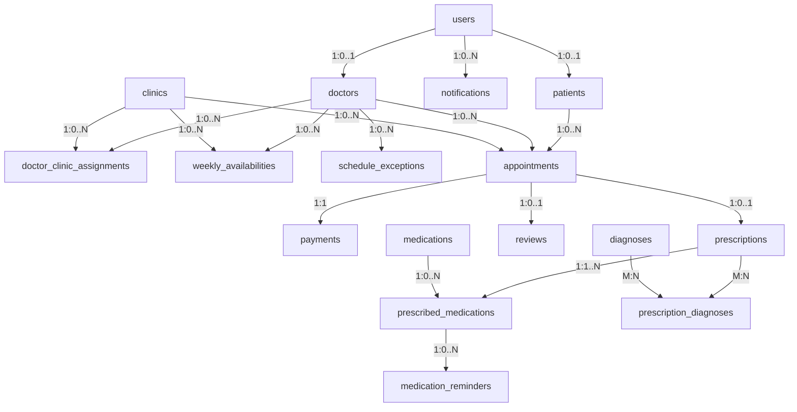

# Relational Database Schema (3NF Specification)

This document specifies the complete 3rd Normal Form (3NF) relational database schema for the Doctor Appointment Management System, including SQL Data Definition Language (DDL) statements, primary/foreign key constraints, check constraints, and relational normalization proofs.

---

## 1. Relational Schema Dependency Graph



---

## 2. SQL DDL Statements (PostgreSQL / Standard ANSI SQL)

```sql
-- Enable UUID extension if PostgreSQL
CREATE EXTENSION IF NOT EXISTS "uuid-ossp";

-- ============================================================================
-- 1. USERS TABLE (Authentication Layer)
-- ============================================================================
CREATE TABLE users (
    user_id UUID PRIMARY KEY DEFAULT uuid_generate_v4(),
    email VARCHAR(255) NOT NULL UNIQUE,
    password_hash VARCHAR(255) NOT NULL,
    role VARCHAR(20) NOT NULL CHECK (role IN ('patient', 'doctor', 'admin')),
    created_at TIMESTAMP WITH TIME ZONE DEFAULT CURRENT_TIMESTAMP NOT NULL,
    updated_at TIMESTAMP WITH TIME ZONE DEFAULT CURRENT_TIMESTAMP NOT NULL
);

-- ============================================================================
-- 2. PATIENTS TABLE
-- ============================================================================
CREATE TABLE patients (
    patient_id UUID PRIMARY KEY DEFAULT uuid_generate_v4(),
    user_id UUID NOT NULL UNIQUE REFERENCES users(user_id) ON DELETE CASCADE,
    full_name VARCHAR(150) NOT NULL,
    address TEXT,
    age INT CHECK (age >= 0 AND age <= 120),
    gender VARCHAR(20) CHECK (gender IN ('Male', 'Female', 'Other', 'Prefer not to say')),
    phone VARCHAR(30) NOT NULL,
    occupation VARCHAR(100),
    company_name VARCHAR(150)
);

-- ============================================================================
-- 3. DOCTORS TABLE
-- ============================================================================
CREATE TABLE doctors (
    doctor_id UUID PRIMARY KEY DEFAULT uuid_generate_v4(),
    user_id UUID NOT NULL UNIQUE REFERENCES users(user_id) ON DELETE CASCADE,
    full_name VARCHAR(150) NOT NULL,
    specialization VARCHAR(100) NOT NULL,
    education TEXT,
    qualifications TEXT,
    years_experience INT CHECK (years_experience >= 0),
    bio TEXT,
    rating DECIMAL(3, 2) DEFAULT 0.00 CHECK (rating >= 0.00 AND rating <= 5.00) NOT NULL
);

-- ============================================================================
-- 4. CLINICS TABLE
-- ============================================================================
CREATE TABLE clinics (
    clinic_id UUID PRIMARY KEY DEFAULT uuid_generate_v4(),
    name VARCHAR(150) NOT NULL,
    address TEXT NOT NULL,
    city VARCHAR(100) NOT NULL,
    contact_info VARCHAR(100) NOT NULL,
    working_hours VARCHAR(255)
);

-- ============================================================================
-- 5. DOCTOR_CLINIC_ASSIGNMENTS TABLE (M:N Relationship with Fees)
-- ============================================================================
CREATE TABLE doctor_clinic_assignments (
    assignment_id UUID PRIMARY KEY DEFAULT uuid_generate_v4(),
    doctor_id UUID NOT NULL REFERENCES doctors(doctor_id) ON DELETE CASCADE,
    clinic_id UUID NOT NULL REFERENCES clinics(clinic_id) ON DELETE CASCADE,
    consultation_fee DECIMAL(10, 2) NOT NULL CHECK (consultation_fee >= 0.00),
    is_active BOOLEAN DEFAULT TRUE NOT NULL,
    CONSTRAINT uq_doctor_clinic UNIQUE (doctor_id, clinic_id)
);

-- ============================================================================
-- 6. WEEKLY_AVAILABILITIES TABLE (Recurring Schedule Template)
-- ============================================================================
CREATE TABLE weekly_availabilities (
    availability_id UUID PRIMARY KEY DEFAULT uuid_generate_v4(),
    doctor_id UUID NOT NULL REFERENCES doctors(doctor_id) ON DELETE CASCADE,
    clinic_id UUID NOT NULL REFERENCES clinics(clinic_id) ON DELETE CASCADE,
    day_of_week VARCHAR(15) NOT NULL CHECK (day_of_week IN ('Monday', 'Tuesday', 'Wednesday', 'Thursday', 'Friday', 'Saturday', 'Sunday')),
    start_time TIME NOT NULL,
    end_time TIME NOT NULL,
    slot_duration_minutes INT DEFAULT 30 CHECK (slot_duration_minutes BETWEEN 10 AND 120) NOT NULL,
    CONSTRAINT chk_valid_time_window CHECK (end_time > start_time)
);

-- ============================================================================
-- 7. SCHEDULE_EXCEPTIONS TABLE (Vacations / Ad-hoc Overrides)
-- ============================================================================
CREATE TABLE schedule_exceptions (
    exception_id UUID PRIMARY KEY DEFAULT uuid_generate_v4(),
    doctor_id UUID NOT NULL REFERENCES doctors(doctor_id) ON DELETE CASCADE,
    start_date DATE NOT NULL,
    end_date DATE NOT NULL,
    type VARCHAR(30) NOT NULL CHECK (type IN ('VACATION', 'BLOCKED', 'EXTRA_AVAILABILITY')),
    CONSTRAINT chk_exception_dates CHECK (end_date >= start_date)
);

-- ============================================================================
-- 8. APPOINTMENTS TABLE
-- ============================================================================
CREATE TABLE appointments (
    appointment_id UUID PRIMARY KEY DEFAULT uuid_generate_v4(),
    patient_id UUID NOT NULL REFERENCES patients(patient_id) ON DELETE RESTRICT,
    doctor_id UUID NOT NULL REFERENCES doctors(doctor_id) ON DELETE RESTRICT,
    clinic_id UUID NOT NULL REFERENCES clinics(clinic_id) ON DELETE RESTRICT,
    booking_date TIMESTAMP WITH TIME ZONE DEFAULT CURRENT_TIMESTAMP NOT NULL,
    appointment_date DATE NOT NULL,
    appointment_time TIME NOT NULL,
    consultation_type VARCHAR(20) NOT NULL CHECK (consultation_type IN ('in-clinic', 'online')),
    reason TEXT,
    duration_minutes INT DEFAULT 30 NOT NULL,
    status VARCHAR(20) NOT NULL CHECK (status IN ('Pending', 'Confirmed', 'Completed', 'Cancelled', 'No-Show')),
    consultation_fee_snapshot DECIMAL(10, 2) NOT NULL CHECK (consultation_fee_snapshot >= 0.00)
);

-- ============================================================================
-- 9. PAYMENTS TABLE (1:1 with Appointments)
-- ============================================================================
CREATE TABLE payments (
    payment_id UUID PRIMARY KEY DEFAULT uuid_generate_v4(),
    appointment_id UUID NOT NULL UNIQUE REFERENCES appointments(appointment_id) ON DELETE CASCADE,
    amount DECIMAL(10, 2) NOT NULL CHECK (amount >= 0.00),
    method VARCHAR(30) NOT NULL CHECK (method IN ('Credit Card', 'Debit Card', 'Cash', 'Insurance')),
    payment_date TIMESTAMP WITH TIME ZONE DEFAULT CURRENT_TIMESTAMP NOT NULL,
    status VARCHAR(20) NOT NULL CHECK (status IN ('Pending', 'Completed', 'Failed', 'Refunded')),
    transaction_ref VARCHAR(100) UNIQUE,
    attempt_count INT DEFAULT 1 CHECK (attempt_count >= 1) NOT NULL
);

-- ============================================================================
-- 10. PRESCRIPTIONS TABLE
-- ============================================================================
CREATE TABLE prescriptions (
    prescription_id UUID PRIMARY KEY DEFAULT uuid_generate_v4(),
    appointment_id UUID NOT NULL UNIQUE REFERENCES appointments(appointment_id) ON DELETE CASCADE,
    issued_date DATE DEFAULT CURRENT_DATE NOT NULL
);

-- ============================================================================
-- 11. DIAGNOSES TABLE (Catalog)
-- ============================================================================
CREATE TABLE diagnoses (
    diagnosis_id UUID PRIMARY KEY DEFAULT uuid_generate_v4(),
    name VARCHAR(150) NOT NULL,
    icd_code VARCHAR(20) NOT NULL UNIQUE,
    description TEXT
);

-- ============================================================================
-- 12. PRESCRIPTION_DIAGNOSES TABLE (M:N Junction)
-- ============================================================================
CREATE TABLE prescription_diagnoses (
    prescription_id UUID NOT NULL REFERENCES prescriptions(prescription_id) ON DELETE CASCADE,
    diagnosis_id UUID NOT NULL REFERENCES diagnoses(diagnosis_id) ON DELETE RESTRICT,
    PRIMARY KEY (prescription_id, diagnosis_id)
);

-- ============================================================================
-- 13. MEDICATIONS TABLE (Catalog)
-- ============================================================================
CREATE TABLE medications (
    medication_id UUID PRIMARY KEY DEFAULT uuid_generate_v4(),
    name VARCHAR(150) NOT NULL,
    generic_name VARCHAR(150) NOT NULL,
    type VARCHAR(50) NOT NULL
);

-- ============================================================================
-- 14. PRESCRIBED_MEDICATIONS TABLE (Prescription Line Items)
-- ============================================================================
CREATE TABLE prescribed_medications (
    prescribed_item_id UUID PRIMARY KEY DEFAULT uuid_generate_v4(),
    prescription_id UUID NOT NULL REFERENCES prescriptions(prescription_id) ON DELETE CASCADE,
    medication_id UUID NOT NULL REFERENCES medications(medication_id) ON DELETE RESTRICT,
    dosage VARCHAR(50) NOT NULL,
    frequency VARCHAR(50) NOT NULL,
    duration VARCHAR(50) NOT NULL,
    instructions TEXT,
    notes TEXT
);

-- ============================================================================
-- 15. MEDICATION_REMINDERS TABLE
-- ============================================================================
CREATE TABLE medication_reminders (
    reminder_id UUID PRIMARY KEY DEFAULT uuid_generate_v4(),
    prescribed_item_id UUID NOT NULL REFERENCES prescribed_medications(prescribed_item_id) ON DELETE CASCADE,
    scheduled_time TIMESTAMP WITH TIME ZONE NOT NULL,
    acknowledgment_status VARCHAR(20) DEFAULT 'PENDING' CHECK (acknowledgment_status IN ('PENDING', 'ACKNOWLEDGED')) NOT NULL,
    completion_status VARCHAR(20) DEFAULT 'TAKEN' CHECK (completion_status IN ('TAKEN', 'MISSED', 'SKIPPED')) NOT NULL
);

-- ============================================================================
-- 16. REVIEWS TABLE (1:1 with Completed Appointments)
-- ============================================================================
CREATE TABLE reviews (
    review_id UUID PRIMARY KEY DEFAULT uuid_generate_v4(),
    appointment_id UUID NOT NULL UNIQUE REFERENCES appointments(appointment_id) ON DELETE CASCADE,
    patient_id UUID NOT NULL REFERENCES patients(patient_id) ON DELETE CASCADE,
    doctor_id UUID NOT NULL REFERENCES doctors(doctor_id) ON DELETE CASCADE,
    rating INT NOT NULL CHECK (rating BETWEEN 1 AND 5),
    comment TEXT,
    submitted_date TIMESTAMP WITH TIME ZONE DEFAULT CURRENT_TIMESTAMP NOT NULL
);

-- ============================================================================
-- 17. NOTIFICATIONS TABLE
-- ============================================================================
CREATE TABLE notifications (
    notification_id UUID PRIMARY KEY DEFAULT uuid_generate_v4(),
    recipient_id UUID NOT NULL REFERENCES users(user_id) ON DELETE CASCADE,
    message TEXT NOT NULL,
    trigger_event VARCHAR(50) NOT NULL,
    sent_at TIMESTAMP WITH TIME ZONE DEFAULT CURRENT_TIMESTAMP NOT NULL,
    read_status VARCHAR(10) DEFAULT 'UNREAD' CHECK (read_status IN ('UNREAD', 'READ')) NOT NULL
);
```

---

## 3. Normalization Compliance (3NF Proof)

* **First Normal Form (1NF)**:
  * All attributes contain atomic, scalar values (no multi-valued CSV strings or arrays in single attributes).
  * Every table possesses a unique Primary Key (`PRIMARY KEY`).

* **Second Normal Form (2NF)**:
  * Meets 1NF requirements.
  * All non-key attributes are fully functionally dependent on the primary key (no partial dependencies on compound keys). For instance, in `doctor_clinic_assignments`, `consultation_fee` depends on the entire pair `(doctor_id, clinic_id)`.

* **Third Normal Form (3NF)**:
  * Meets 2NF requirements.
  * Contains zero transitive dependencies ($X \rightarrow Y$ and $Y \rightarrow Z$).
  * `consultation_fee` was moved out of `doctor` to `doctor_clinic_assignments` so fee does not depend on clinic name via doctor.
  * `Medical History` is omitted as a stored table because it depends transitively on patient appointments and prescriptions.
