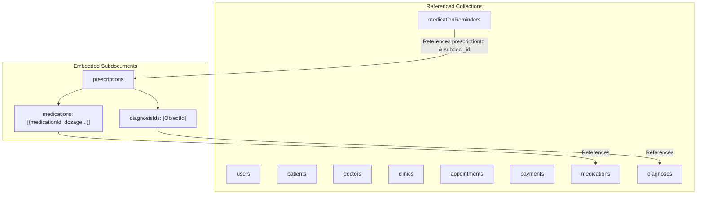

# MongoDB Document Architecture & Design Strategy

This document outlines the NoSQL MongoDB document modeling strategy for the Doctor Appointment Management System, detailing document normalization choices, referencing vs. embedding trade-offs, subdocument architectures, and aggregation pipeline pipelines for dynamic clinical data assembly.

---

## 1. Architectural Philosophy & Strategy

MongoDB provides high write throughput, rich document nesting, flexible schema evolution, and expressive aggregation features. In designing the NoSQL database model, two core guiding principles were enforced:

1. **Referencing (Normalizing with ObjectIds)**: Applied when entities have independent query access patterns, high cardinality growth, or are updated/shared across multiple parents (e.g., Doctors, Patients, Clinics, Appointments, Medications).
2. **Embedding (Denormalizing as Subdocuments)**: Applied when sub-entities are strictly owned by a single parent document, created together, fetched together, and do not possess standalone query lifecycles outside the parent context.



---

## 2. Referencing vs. Embedding Decision Matrix

| Entity / Relationship | Modeling Choice | Design Rationale & Implementation |
|---|---|---|
| **User $\rightarrow$ Patient / Doctor** | **Referenced (`ObjectId`)** | Keeps authentication light and separate from heavy professional/clinical profiles. |
| **Doctor $\leftrightarrow$ Clinic** | **Referenced (`doctorClinicAssignments`)** | Independent query access for clinic rosters and doctor fee management across facilities. |
| **Weekly Availability & Exceptions** | **Referenced Collection** | Frequently updated schedules queried independently during slot calculations. |
| **Appointment $\rightarrow$ Payment** | **Referenced (`payments`)** | Payment logs, gateway retries, and transaction audit entries queried independently by finance staff. |
| **Prescription $\rightarrow$ Prescribed Medication** | **EMBEDDED (`medications: [...]`)** | Prescribed dosage/instructions are written once at visit completion and always read *with* the prescription. |
| **Prescription $\leftrightarrow$ Diagnosis** | **Array of ObjectIds (`diagnosisIds: [...]`)** | Diagnosis catalog items are shared globally; link carries no attributes, so an array of ObjectIds on `prescription` is optimal. |
| **Medication Reminder** | **Referenced (`medicationReminders`)** | Background cron jobs scan reminders globally by `scheduledTime` and `completionStatus`. |

---

## 3. Dynamic Medical History via MongoDB Aggregation

Rather than storing redundant, stale medical history documents, patient history is computed on-demand using a MongoDB `$lookup` aggregation pipeline.

### Aggregation Pipeline Code

```javascript
db.patients.aggregate([
  // 1. Filter for the target patient
  { $match: { _id: ObjectId("65c3b1a2e4b0123456789abc") } },

  // 2. Join patient's appointments
  {
    $lookup: {
      from: "appointments",
      localField: "_id",
      foreignField: "patientId",
      as: "appointmentHistory"
    }
  },
  { $unwind: "$appointmentHistory" },

  // 3. Filter for Completed appointments only
  { $match: { "appointmentHistory.status": "Completed" } },

  // 4. Join Doctor details
  {
    $lookup: {
      from: "doctors",
      localField: "appointmentHistory.doctorId",
      foreignField: "_id",
      as: "doctorInfo"
    }
  },

  // 5. Join Clinic details
  {
    $lookup: {
      from: "clinics",
      localField: "appointmentHistory.clinicId",
      foreignField: "_id",
      as: "clinicInfo"
    }
  },

  // 6. Join Prescriptions issued for each appointment
  {
    $lookup: {
      from: "prescriptions",
      localField: "appointmentHistory._id",
      foreignField: "appointmentId",
      as: "prescriptionInfo"
    }
  },

  // 7. Project clean, unified Medical History records
  {
    $project: {
      patientId: "$_id",
      patientName: "$fullName",
      appointmentId: "$appointmentHistory._id",
      visitDate: "$appointmentHistory.appointmentDate",
      doctorName: { $arrayElemAt: ["$doctorInfo.fullName", 0] },
      specialization: { $arrayElemAt: ["$doctorInfo.specialization", 0] },
      clinicName: { $arrayElemAt: ["$clinicInfo.name", 0] },
      reasonForVisit: "$appointmentHistory.reason",
      prescription: { $arrayElemAt: ["$prescriptionInfo", 0] }
    }
  },

  // 8. Sort by visit date descending
  { $sort: { visitDate: -1 } }
]);
```
