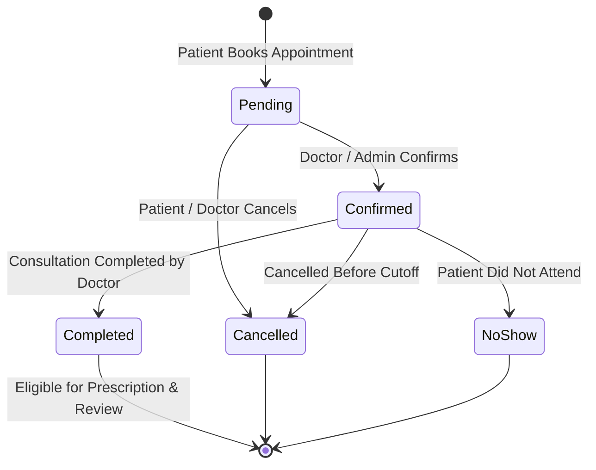

# Business Logic & System Constraints

This document specifies the formal business rules, validation constraints, state machines, and data integrity engines enforced across the Doctor Appointment Management System.

---

## 1. Authentication & Identity Business Rules

| Rule ID | Rule Name | Description | Enforcement Mechanism |
|---|---|---|---|
| **BR-AUTH-001** | Unique Email Identity | Every user must have a unique, lowercase email address. | Database Unique Index on `User.email`. |
| **BR-AUTH-002** | Role Assignment | A user must be assigned exactly one role: `patient`, `doctor`, or `admin`. | Enum validation on `User.role`. |
| **BR-AUTH-003** | Profile Coupling | Users with `role = 'patient'` MUST have a `Patient` profile. Users with `role = 'doctor'` MUST have a `Doctor` profile. Admins MUST NOT have profile entries. | 1:0..1 Foreign Key constraint (`userId` unique index). |
| **BR-AUTH-004** | Password Hashing | Plaintext passwords must never be stored. Credentials must be hashed (bcrypt/Argon2) before write. | Pre-save authentication guard. |

---

## 2. Availability & Scheduling Rules

| Rule ID | Rule Name | Description | Enforcement Mechanism |
|---|---|---|---|
| **BR-SCHED-001** | Valid Time Window | `WeeklyAvailability.endTime` must be strictly after `startTime`. | Validation rule `endTime > startTime`. |
| **BR-SCHED-002** | Slot Granularity | `slotDurationMinutes` must be a positive integer (e.g., 30, 45, 60 minutes) and evenly divide the available window. | Validation rule `slotDurationMinutes > 0`. |
| **BR-SCHED-003** | Exception Date Validation | `ScheduleException.endDate` must be `>= startDate`. | Validation rule `endDate >= startDate`. |
| **BR-SCHED-004** | Anti-Overlapping Booking | No two active appointments (`Pending`, `Confirmed`, `Completed`) may exist for the same doctor at overlapping times. | Compound index on `(doctorId, appointmentDate, appointmentTime)` + service validation. |

---

## 3. Appointment Lifecycle & State Machine

| Rule ID | Rule Name | Description | Enforcement Mechanism |
|---|---|---|---|
| **BR-APP-001** | Financial Price Snapshotting | Upon appointment booking, `consultationFeeSnapshot` is captured and frozen on the appointment record. | Application service layer snapshot. |
| **BR-APP-002** | Allowed Consultation Types | `consultationType` must be `'In-Clinic'` or `'Online'`. | Enum validation constraint. |
| **BR-APP-003** | State Machine Hierarchy | Status transitions must follow the valid state machine diagram above (`Pending`, `Confirmed`, `Completed`, `Cancelled`, `No-Show`). | Application service state check. |
| **BR-APP-004** | Slot Availability Guard | Appointment time must align with an active `WeeklyAvailability` slot and must not be blocked by a `ScheduleException`. | Application service slot check. |

---

## 4. Clinical Prescriptions

| Rule ID | Rule Name | Description | Enforcement Mechanism |
|---|---|---|---|
| **BR-RX-001** | Post-Completion Generation | A `Prescription` can only be generated for an appointment in `Completed` status. | Application service check / pre-save validation. |
| **BR-RX-002** | Single Prescription Per Visit | An appointment yields at most one prescription. | `UNIQUE` index on `Prescription.appointmentId`. |
| **BR-RX-003** | Subdocument Embedded Line Items | Prescribed medications (dosage, frequency, duration, instructions, notes) are embedded directly inside `Prescription.medications`. | Schema subdocument array definition. |
| **BR-RX-004** | Shared Diagnosis Catalog | Diagnoses linked to a prescription must reference valid master catalog entries in `Diagnosis`. | Array of ObjectIds reference check (`diagnosisIds`). |

---

## 5. Review & Rating Integrity

| Rule ID | Rule Name | Description | Enforcement Mechanism |
|---|---|---|---|
| **BR-REV-001** | Verified Visit Review | A `Review` can only be submitted for an appointment with status `Completed`. | Application validation hook. |
| **BR-REV-002** | One Review Per Appointment | Each completed appointment allows at most one review. | `UNIQUE` index on `Review.appointmentId`. |
| **BR-REV-003** | Rating Score Bounds | Review rating must be a number between 1 and 5 inclusive. | Range check constraint `1 <= rating <= 5`. |
