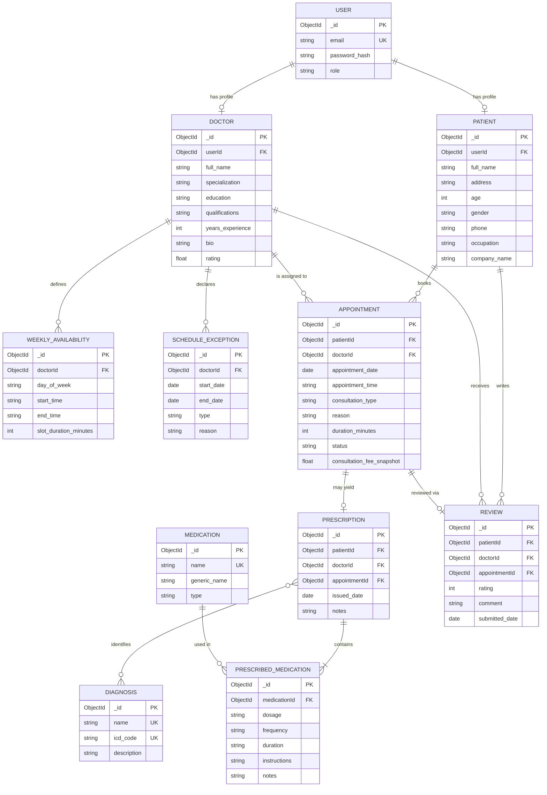

# Entity Relationships & Diagram

This document describes all relationships, cardinalities, and data mapping rules in the Doctor Appointment Management System.

---

## 1. Entity-Relationship Diagram (Simplified)

---

## 2. Relationship Reference Matrix

| Relationship | Cardinality | FK Location | Foreign Entity | Notes / Constraints |
|---|---|---|---|---|
| User $\rightarrow$ Patient | 1 : 0..1 | `Patient.userId` | `User._id` | Unique FK; present only when `role = 'patient'` |
| User $\rightarrow$ Doctor | 1 : 0..1 | `Doctor.userId` | `User._id` | Unique FK; present only when `role = 'doctor'` |
| Doctor $\rightarrow$ WeeklyAvailability | 1 : 0..N | `WeeklyAvailability.doctorId` | `Doctor._id` | Recurring weekly schedule template per doctor |
| Doctor $\rightarrow$ ScheduleException | 1 : 0..N | `ScheduleException.doctorId` | `Doctor._id` | One-off departures (vacations, blocked shifts) |
| Patient $\rightarrow$ Appointment | 1 : 0..N | `Appointment.patientId` | `Patient._id` | A patient books many visits |
| Doctor $\rightarrow$ Appointment | 1 : 0..N | `Appointment.doctorId` | `Doctor._id` | A doctor sees many patients |
| Appointment $\rightarrow$ Prescription | 1 : 0..1 | `Prescription.appointmentId` | `Appointment._id` | Unique FK; created post-appointment completion |
| Prescription $\rightarrow$ Diagnosis | M : N | `Prescription.diagnosisIds` | `Diagnosis._id` | Array of ObjectIds (references shared catalog entries) |
| Prescription $\rightarrow$ Medication | M : N | Embedded Subdocument | `Medication._id` | `medications` array; dosage/frequency per prescription |
| Patient $\rightarrow$ Review | 1 : 0..N | `Review.patientId` | `Patient._id` | Reviews written by patient |
| Doctor $\rightarrow$ Review | 1 : 0..N | `Review.doctorId` | `Doctor._id` | Reviews received by doctor |
| Appointment $\rightarrow$ Review | 1 : 0..1 | `Review.appointmentId` | `Appointment._id` | Unique FK; enforces 1 review per completed visit |

---

## 3. MongoDB Mapping Guidelines (Referencing vs. Embedding)

1. **Top-Level Collections (10 Collections)**:
   - `users`, `patients`, `doctors`, `weeklyavailabilities`, `scheduleexceptions`, `appointments`, `prescriptions`, `diagnoses`, `medications`, `reviews`.
   - Independent collections allow direct querying, clean schema updates, and efficient indexing.

2. **Embedded Subdocument Pattern**:
   - `prescribedMedication` subdocuments are embedded inside `prescriptions` (`prescription.medications: [{ medicationId, dosage, frequency, duration, instructions, notes }]`).
   - Mongoose auto-assigns `_id` to each subdocument item.

3. **Array of ObjectIds Pattern**:
   - `prescription.diagnosisIds: [ObjectId]` references items in the global `diagnoses` catalog directly without requiring a junction collection.
