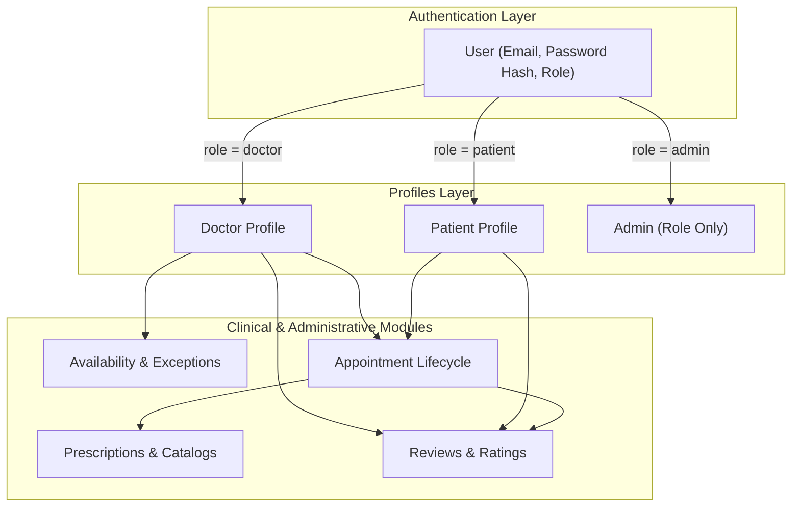

# Doctor Appointment Management System — System Description

## 1. Executive Summary

The **Doctor Appointment Management System** is a streamlined digital healthcare platform designed to connect patients directly with doctors. The platform simplifies the clinical lifecycle — from doctor discovery, availability scheduling, and appointment booking to electronic prescriptions, reusable medical catalogs, verified patient reviews, and administrative analytics.

Built with security, simplicity, and clinical integrity as primary design goals, the system employs a role-based access control (RBAC) architecture built on a single, unified authentication core, ensuring secure access across patients, doctors, and system administrators.

---

## 2. Core Architectural Pillars & Philosophy

### 2.1 Unified Authentication & Profile Extension
The foundation of the database design separates **Identity & Authentication** from **Domain Profiles**:
* **Identity (`User`)**: Holds pure authentication data — credentials (`email`, `password_hash`) and access control (`role`: `patient`, `doctor`, `admin`). It contains no personal or clinical information.
* **Profile Extensions (`Patient` / `Doctor`)**: Extend the `User` account in a `1 : 0..1` relationship depending on the role. Administrators operate directly via the `User` account without requiring a separate profile entity, minimizing storage overhead and avoiding redundant collections.

### 2.2 Consultation Fee Snapshotting
* **Consultation Fee**: Stored directly on the appointment record (`consultationFeeSnapshot`) at the time of booking.
* **Price Snapshotting**: Freezes the agreed consultation rate when an appointment is booked so that any subsequent profile fee adjustments never alter past records.

### 2.3 Two-Tier Availability Engine
Doctor availability is decomposed into two distinct, non-conflicting components:
1. **Weekly Availability (Recurring Template)**: Defines recurring day-of-week slots, time windows, and slot durations per doctor.
2. **Schedule Exceptions (Ad-hoc Overrides)**: Captures one-off deviations (vacations, blocked days, emergency leave).
*Slot computation evaluates requested times against both tiers simultaneously to guarantee zero double-booking.*

### 2.4 Prescription & Medication Architecture
* **Shared Catalogs**: `Diagnosis` (ICD codes) and `Medication` (generic names, formulations) serve as reusable master reference catalogs across all prescriptions.
* **Prescribed Medication Subdocuments**: Dosage, frequency, duration, administration instructions, and notes are embedded directly within prescription subdocument line items (`medications`).

### 2.5 Dynamic Medical History (Aggregation View)
Medical history is **not** stored as a static, duplicated database collection. Instead, it is computed on-demand through efficient MongoDB aggregation pipelines joining a patient's historical prescriptions, diagnoses, prescribed medications, appointments, and doctor profiles. This eliminates data redundancy and prevents stale clinical records.

---

## 3. High-Level Subsystem Breakdown

### 3.1 User & Identity Management
* **Single Sign-On / Unified Auth**: Single entry point for all roles (`patient`, `doctor`, `admin`).
* **Patient Profile**: Captures demographics, address, age, gender, phone number, occupation, and company name.
* **Doctor Profile**: Tracks qualifications, medical specialization, education, experience, bio, and aggregate ratings.

### 3.2 Doctor & Availability Subsystem
* **Weekly Templates**: Defines recurring daily work windows and appointment slot durations for each doctor.
* **Schedule Exceptions**: Allows doctors to set vacations, block specific days, or log emergency schedule changes.
* **Slot Generation Engine**: Calculates available booking slots using weekly templates minus schedule exceptions and active bookings.

### 3.3 Appointment Engine
* **Booking & State Machine**: Manages appointment lifecycle status (`Pending`, `Confirmed`, `Completed`, `Cancelled`, `No-Show`).
* **Fee Snapshotting**: Freezes consultation fee snapshot upon booking.
* **Conflict Prevention**: Partial indexes and atomic checks prevent overlapping appointments for the same doctor at the same time.

### 3.4 Clinical & Patient Care Subsystem
* **Prescriptions**: Issued by doctors post-appointment (linked 1:1 with completed appointments).
* **Diagnosis Catalog**: Reusable master catalog with ICD code mapping.
* **Medication Catalog**: Reusable master catalog with generic drug definitions.
* **Reviews & Ratings**: Enables verified patients to submit one review per completed appointment, maintaining rating integrity.

### 3.5 Administrative Dashboard & Analytics
* **System Operations**: Role-based administrative access to manage master catalogs, view platform statistics, and oversee user activity.
