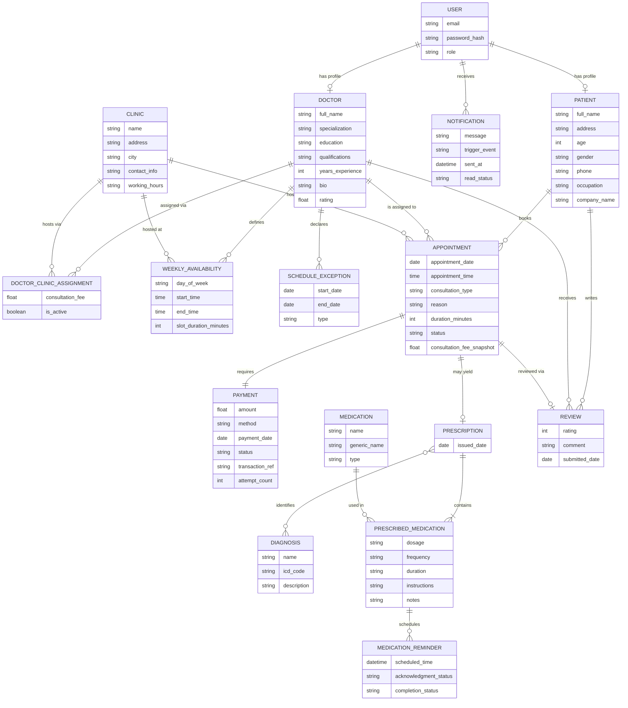

# Doctor Appointment Management System — Revised Description

The system represents an online healthcare and doctor appointment management platform that connects patients with doctors, allowing patients to search for doctors, schedule appointments, manage medical records, receive prescriptions, and monitor their treatment progress. Access to the platform is role-based, with patients, doctors, and administrators sharing one unified authentication layer while maintaining separate professional and clinical data.

Every person who logs into the system does so through a single **User** account, which stores login credentials (email, hashed password) and a role (`patient`, `doctor`, or `admin`). This account is a pure authentication record — it holds no personal or clinical data itself. Depending on its role, a User is extended by exactly one **Patient** or **Doctor** profile (an admin has neither, since administrators only need login access to reporting tools). Centralizing authentication this way means the platform has one login flow, one password-reset flow, and one place to check permissions, instead of duplicating that logic three times.

Each **Patient** profile holds full name, address, age, gender, phone number, occupation, and company name (if applicable). A patient may book multiple appointments with different doctors over time, and may hold only one Patient profile, tied back to their User account.

Each **Doctor** profile holds professional information: medical specialization, educational background, professional qualifications, years of experience, biography, and overall rating. Consultation fee is **not** stored on the Doctor profile, since a doctor's fee can differ from clinic to clinic — it lives on the doctor-clinic assignment instead (see below). A doctor may practice at one or more clinics, and each clinic can host multiple doctors.

The system supports multiple **Clinics**, each storing clinic name, address, city, contact information, and working hours.

Because a doctor's fee and working schedule vary by clinic, the doctor-clinic relationship is represented by its own **Doctor-Clinic Assignment** entity, which stores the consultation fee and active status for that specific doctor-clinic pairing. This resolves what would otherwise be a contradiction — a single fee could not simultaneously live on the doctor and vary per clinic.

A doctor's availability is split into two distinct concepts rather than one blended entity. **Weekly Availability** defines the recurring template: which days of the week a doctor is available, at which clinic, during which time window, and in what slot size. **Schedule Exceptions** capture one-off departures from that template — vacations, blocked days, or ad-hoc extra availability — each with a start date, end date, and type. Appointment booking is validated against both: a requested slot must fall inside a Weekly Availability window, must not be blocked by a Schedule Exception, and must not overlap an existing Appointment.

When a patient books a visit, the system creates an **Appointment**, associated with exactly one patient, one doctor, and one clinic. Each appointment stores booking date, appointment date, appointment time, consultation type (in-clinic or online), reason for visit, estimated duration, and status (Pending, Confirmed, Completed, Cancelled, or No-Show). The consultation fee is copied onto the appointment as a snapshot at booking time — so a rate change to the doctor-clinic assignment months later never rewrites what a patient was actually charged for a past visit.

Every appointment requires exactly one **Payment** record, storing amount, method, payment date, status, transaction reference, and an attempt count in case a charge needs to be retried before it succeeds.

After a completed appointment, the doctor creates a **Prescription** for the patient, linked to exactly that one appointment.

A prescription may reference one or more **Diagnoses** — reusable, catalog-style records (condition name, ICD code, description) shared across the whole platform, since the same diagnosis legitimately recurs across many prescriptions and many patients.

A prescription may also include one or more **Medications**, drawn from a shared Medication catalog (name, generic name, type). Because dosage, frequency, duration, administration instructions, and notes differ every time a medication is prescribed, that information is not stored on Medication itself — it's stored on a **Prescribed Medication** entry, one per medication-per-prescription, which is what actually carries the many-to-many relationship's data.

Based on each Prescribed Medication entry, the system generates one or more **Medication Reminders**, each tied to that specific entry (not to the medication in general) so the reminder reflects the exact dosage and timing the doctor prescribed for that patient. Each reminder tracks acknowledgment and completion status.

The platform's **Medical History** is not a stored entity in its own right — it's an aggregated view assembled on demand from a patient's appointments, prescriptions, diagnoses, and medications, letting doctors review past visits and recurring conditions without the system maintaining a duplicate, ever-stale copy of that data.

After a completed appointment, a patient may submit a **Review**, tied to that specific appointment (not just loosely to the doctor), which is what allows a patient with several visits to the same doctor to leave a separate, honest review for each one, and prevents a review existing without a real completed visit behind it.

The system sends **Notifications** to any User — patient, doctor, or admin — covering appointment confirmations, cancellations, rescheduling, payment confirmations, medication reminders, and daily summaries, each stored with a message, trigger event, timestamp, and read status.

Finally, the system generates reports and statistics — appointment volume, doctor performance, clinic utilization, patient attendance, revenue, and frequently diagnosed conditions — for administrators, drawn from the same underlying data rather than a separate reporting schema.

---

## Entity-Relationship Diagram

---

## Relationship Reference

| Relationship | Cardinality | Notes |
|---|---|---|
| User → Patient | 1 : 0..1 | Only present when `role = patient` |
| User → Doctor | 1 : 0..1 | Only present when `role = doctor` |
| User → Notification | 1 : 0..N | A user may receive many notifications |
| Doctor ↔ Clinic | M : N (via Doctor-Clinic Assignment) | Assignment entity carries fee + active status |
| Doctor → Weekly Availability | 1 : 0..N | Per doctor, per clinic |
| Doctor → Schedule Exception | 1 : 0..N | Vacations / one-off blocks |
| Patient → Appointment | 1 : 0..N | A patient books many appointments |
| Doctor → Appointment | 1 : 0..N | A doctor is assigned to many appointments |
| Clinic → Appointment | 1 : 0..N | An appointment happens at exactly one clinic |
| Appointment ↔ Payment | 1 : 1 | Every appointment requires exactly one payment |
| Appointment → Prescription | 1 : 0..1 | Only exists once the appointment is completed |
| Prescription ↔ Diagnosis | M : N | No attributes on the link itself |
| Prescription → Prescribed Medication | 1 : 1..N | A prescription needs at least one medication line |
| Medication → Prescribed Medication | 1 : 0..N | Same medication reused across prescriptions |
| Prescribed Medication → Medication Reminder | 1 : 0..N | Reminder inherits this entry's dosage/timing |
| Patient → Review | 1 : 0..N | A patient may write many reviews |
| Doctor → Review | 1 : 0..N | A doctor may receive many reviews |
| Appointment → Review | 1 : 0..1 | One review per completed appointment, enforced |

---

## MongoDB Mapping

MongoDB is document-oriented, so not every relationship above becomes its own collection — the rule of thumb used here is: **reference when the related data needs to be queried or updated independently; embed when it's always fetched together with its parent and carries no independent query pattern.**

**Top-level collections (referenced by ObjectId):**
- `users`, `patients`, `doctors`, `clinics`, `doctorClinicAssignments`, `weeklyAvailabilities`, `scheduleExceptions`, `appointments`, `payments`, `prescriptions`, `diagnoses`, `medications`, `medicationReminders`, `reviews`, `notifications`.

These stay separate because each one is queried on its own outside the context of its "parent" — reminders are scanned globally by due time, notifications are queried per-user inbox, appointments are queried by doctor+date for conflict checks, and so on.

**One deliberate embedding:** `prescribedMedication` entries are stored as a subdocument array **inside** the `prescriptions` document (`prescription.medications: [{ medicationId, dosage, frequency, duration, instructions, notes }]`) rather than as their own collection. They're always read and written together with their parent prescription, and Mongoose automatically assigns each subdocument its own `_id`, which `medicationReminders` documents reference (`{ prescriptionId, prescribedItemId }`) — giving reminders the precise per-patient dosage/timing without needing a fully separate join collection.

**Prescription ↔ Diagnosis** is handled as a plain array of references on the prescription document (`prescription.diagnosisIds: [ObjectId]`) rather than a junction collection, since the relationship itself carries no attributes — there's nothing to store *about* the link, only the link.

**Key indexes worth setting up early:**
- `appointments`: compound index on `{ doctorId: 1, appointmentDate: 1, appointmentTime: 1 }`, ideally a partial index excluding `status: "Cancelled"`, to make double-booking checks fast.
- `medicationReminders`: compound index on `{ scheduledTime: 1, completionStatus: 1 }` for the background job that polls due reminders; consider a TTL index to auto-expire old completed reminders.
- `doctorClinicAssignments`: unique compound index on `{ doctorId: 1, clinicId: 1 }` to prevent duplicate assignments.
- `reviews`: unique index on `appointmentId` to enforce one review per appointment.
- `payments`: unique index on `appointmentId` to enforce the 1:1 relationship.
- `notifications`: compound index on `{ recipientId: 1, readStatus: 1, sentAt: -1 }` for fast inbox queries.

**Referential integrity note:** MongoDB has no native foreign-key constraints, so relationships that must hold (e.g. an appointment always pointing to a real doctor, a review only existing for a `Completed` appointment) are enforced at the application layer — Mongoose pre-save hooks or service-level checks before writes, rather than the database itself rejecting a bad reference.

**Medical History** is not a collection at all — it's assembled at read time with a MongoDB aggregation pipeline (`$lookup` stages joining `appointments` → `prescriptions` → embedded medications → `diagnoses`) scoped to one patient, so there's never a second copy of clinical data to keep in sync.
